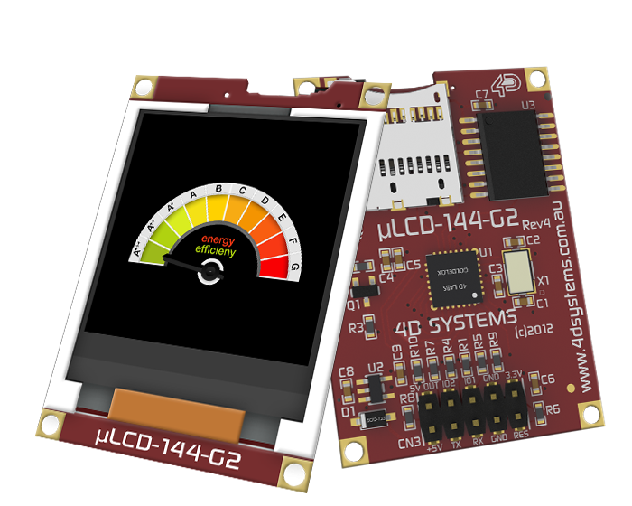
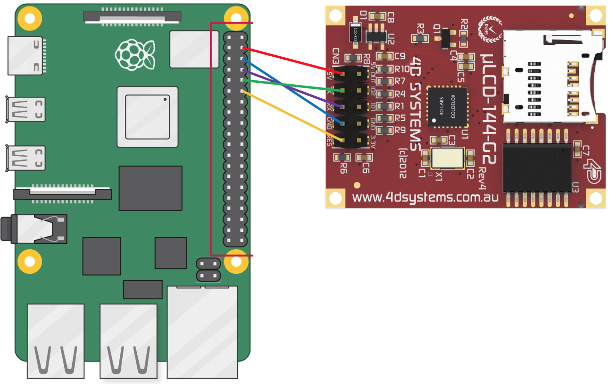

# uLCD-144-G2 Color LCD c++ library for Raspberry Pi
This is a project that ports the uLCD C++ library from mbed to Raspberry Pi (Raspian).

Created by:
<br>Andrew (Andy) Vernetti
<br>Xingyang (Xandy) Liu

Created for:
Georgia Tech ECE4180-A Embedded Systems Design - Final Project

Link to presentation:
<br>https://gtvault-my.sharepoint.com/:p:/g/personal/xliu692_gatech_edu/EZUG6LonL1lEtXxe1roh7rYBdf_xUQtChRn7HLR5sKzqLw?e=OXDKkN

## Parts list
- Raspberry Pi Zero W / 3
- uLCD-144-G2 128 by 128 Smart Color LCD


Raspberry Pi 40-pin header. (source: https://www.raspberrypi.org/documentation/usage/gpio/)



ULCD-144-G2 LCD. (source: https://4dsystems.com.au/ulcd-144-g2)

## Schematics


## The Raspberry Pi UARTs 
By default, on Raspberry Pis equipped with the wireless/Bluetooth module (Raspberry Pi 3 and Raspberry Pi Zero W), the PL011 UART is connected to the Bluetooth module, while the mini UART is used as the primary UART and will have a Linux console on it. On all other models, the PL011 is used as the primary UART.

In Linux device terms, by default, /dev/ttyS0 refers to the mini UART, and /dev/ttyAMA0 refers to the PL011. The primary UART is the one assigned to the Linux console, which depends on the Raspberry Pi model as described above. There are also symlinks: /dev/serial0, which always refers to the primary UART (if enabled), and /dev/serial1, which similarly always refers to the secondary UART (if enabled).

By default, the UART transmit and receive pins are on GPIO 14 and GPIO 15 respectively, which are pins 8 and 10 on the GPIO header.

(source: https://www.raspberrypi.org/documentation/configuration/uart.md)

## How to use UART output on GPIO
We need to enable Serial Port and disable Serial Console. You can do this via either GUI or command line.

GUI: Go to Preferences > Raspberry Pi Configuration > Interfaces > Enable Serial Port and Disable Serial Console.

Command line: sudo raspi-config > 5 Interfacing Options > P6 Serial > No (login shell) > Yes (serial port hardware)

To test UART working correctly, connect TX (GPIO_14) to RX (GPIO_15). We have written a short c program called UARTtest.cpp for testing. The library we used is PIGPIO (http://abyz.me.uk/rpi/pigpio/cif.html#serOpen), which comes with the latest Raspian. You should see the letters A to Z in the command line when running the test program.

Compile in command line: `g++ -Wall -pthread -o "UARTtest" "UARTtest.cpp" -lpigpio`

Run in command line: `sudo ./UARTtest`

Troubleshooting: If you do not see the expected result and either see continuous running program with errors, or see program freezing without finishing, first quit the program by hitting Ctrl + C, then go into UARTtest.cpp and change the following line:

`char *devtty = (char *)"/dev/serial0";`

Change `serial0` to `serial1`, or `ttyS0`, or `ttyAMA0`.

## Wiring uLCD to Pi

LCD pins    |       PI GPIO pins
---         |       ---
+5V         |       2 or 4 (5V Power)
RX          |       8 (GPIO_14 / TXD)
TX          |       10 (GPIO_15 / RXD)
GND         |       14 (GND)
RST         |       12 (GPIO_18)

## Saving Images/Videos to SD Card

In order to use the API functions to display images, videos, and to read/write data, an unformatted uSD card must be inserted into the uLCD.

The easiest way to create an unformatted uSD card is to use the software IDE that is provided by the manufacturer of the LCD. This software is called Workshop4 and can be downloaded here: https://4dsystems.com.au/workshop4

Once downloaded, run the software. It will prompt you to select the LCD screen you're using, then make a serial project for it.

 Now we will prepare our SD card. In Workshop4, open the tool called RMPET (Removable Media Partition Edit Tool). Insert your desired uSD card into your computer, and select it as the drive to edit. If it has already been formatted, which chances are it has, you will have to delete the partition table. Then create a new partition table. I split my SD card with 1 GB of FAT16 and the remaining 3 GB I left unformatted. Then click create partition size, make sure the cluster size is set to max, 512, and then click format. Now you have a usable SD card.

Loading images and videos onto your newly unformatted SD card is also done via Workshop4. This time, run the software and open the tool called Graphics Composer. Make sure the correct screen size is selected on the bottom right. Now click Add in the bottom left to select your desired image or video. Now click build. You will first have to save the .gcs file, then you will select 4DGL - uSD Raw in order to save the raw binary data onto the SD card. Make sure the correct drive is selected. Optionally, you can enter an offset if you want to save the data at a specific location, otherwise the software will save it as soon as it can in the unformatted partition. Now click OK and the tool will save the data. Before you exit, click the GC button at the top of the tool and take note of the location that the data is saved. This pair of hex numbers will be the two inputs to the display_image or display_video functions. Now you are ready to use the API!

## Demo Program and Videos

We have written 3 demo programs: demo_text.cpp, demo_graphics.cpp, demo_media.cpp.

For example, to run the demo program for text, compile in command line: `g++ -Wall -pthread -o "demo_text" demo_text.cpp uLCD_4DGL_main.cpp uLCD_4DGL_Graphics.cpp uLCD_4DGL_Text.cpp -lpigpio`

Then run in command line: `sudo ./demo_text`

demo_text demo video: https://www.youtube.com/watch?v=72G-MMXiyhI

demo_graphics demo video: https://www.youtube.com/watch?v=awc3ZDoNaCo

demo_media demo video: https://youtu.be/H60eHGhcXFQ 

## Notes
`printf()`: this uses `getc()`. `getc()` works. It is hard to make `printf()` work, since Class `uLCD_4DGL` inherits from `public Stream` class, which is a mbed os class. I commented it out because `Stream` class does not exist in Pi. For just printing out a string, `puts()` works, but need to manually putting `putc('\n');` afterwards for newline.

`set_font()`, `set_font_size()` and `text_string()`: FONT_7X8 is the only built-in system font. To set the external fonts (media fonts), “Set Sector Address” should be used to set the sector address of the font data saved on the uSD card. The Sector address could be found from the include file generated by the 4D Workshop4 IDE when a string object is dropped on to the screen and the file is compiled to write the Fonts data to the uSD card. Check the Application Note 4D-AN-00084 for further details. Use `text_width()` and `text_height()` instead. `text_string()` works if the `font` argument is FONT_7X8, since it calls `set_font()` within.

## Working Functions
```c++
class uLCD_4DGL 
{
public :
    uLCD_4DGL(unsigned rst);
    ~uLCD_4DGL();
    void cls();
    void reset();
    void baudrate(int speed); // Only support a handful of speed options
    void background_color(int color); // need to cls() to take effect
    void textbackground_color(int color);
    void display_control(char mode); // change display orientation
    void display_power(char mode); //uLCD-144-G2 does not support Contrast ‘levels’, values from 1-15 turn the display ‘On’, 0 turn the Display ‘Off’
    void set_volume(char value); // not supported. no internal speaker for testing.
    // Graphics Commands
    void circle(int x , int y , int radius, int color);
    void filled_circle(int x , int y , int radius, int color);
    void triangle(int, int, int, int, int, int, int);
    void line(int, int, int, int, int);
    void rectangle(int, int, int, int, int);
    void filled_rectangle(int, int, int, int, int);
    void pixel(int, int, int);
    int  read_pixel(int, int); // read 16-bit color value. works at 9600 baud rate.
    void pen_size(char); // SOLID or OUTLINE. called before circle() or rectangle()
    void BLIT(int x, int y, int w, int h, int *colors);
    // Text Commands
    void set_font(char); // only system font support. media font requires data font saved on sd card
    void set_font_size(char width, char height);  
    void text_mode(char); // OPAQUE or TRANSPARENT
    void text_bold(char); // ON or OFF
    void text_italic(char); // ON or OFF
    void text_inverse(char); // ON or OFF
    void text_underline(char); // ON or OFF
    void text_width(char); // 1 to 16
    void text_height(char); // 1 to 16
    void text_char(char, char, char, int);
    void text_string(char *, char, char, char, int);
    void locate(char, char);
    void color(int);
    void putc(char);
    void puts(char *);
    //Media Commands
    int media_init();
    void set_byte_address(int, int); // Offset number of bytes from beginning
    void set_sector_address(int, int); // Offset number of sectors (512 bytes) from beginning 
    char read_byte();
    int  read_word();
    void write_byte(int);
    void write_word(int);
    void flush_media(); // Needed after a write to SD card, pads the rest of the sector with 0xFF
    void display_image(int, int); // Use hex values from .GC file to find where Workshop4 saved the data onto the SD
    void display_video(int, int);
    void display_frame(int, int, int); // Displays frame of a video, last int is frame number
protected :
    //used by printf
    virtual int _putc(int c);
    void freeBUFFER  (void);
    void writeBYTE   (char);
    void writeBYTEfast   (char);
    int  writeCOMMAND(char *, int);
    int  writeCOMMANDnull(char *, int);
    int  readVERSION (char *, int); // called by version()
    int  getSTATUS   (char *, int, char *, int); // can be used to get display model
    int  version     (void); // get SPE version. return 0 for correct return.
};
```
